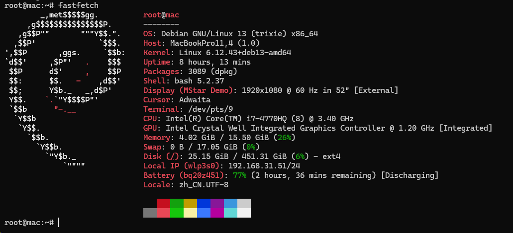

<div align="center">
  <a href="https://github.com/VincentZyu233/mac-smc-bat-guardian"></a>
  <a href="https://gitee.com/vincent-zyu/mac-smc-bat-guardian"></a>
</div>

# 🛡️ mac-smc-bat-guardian

> [📖English](readme.md)
> [📖中文说明](readme.zh-cn.md)

## 🚀 Project Introduction
This project provides a Python/Textual TUI for real-time MacBook battery, power, fan, and event-log monitoring on Linux.
It also includes an optional C prototype that attempts to write the SMC `BCLM` key as an experiment in charge-threshold control.

> [!IMPORTANT]
>
> ⚠️ **Current status: charge-threshold control remains experimental and did not take effect on the author's test device.**
>
> A "write succeeded" message from `smc_control` only confirms that the program completed an I/O-port write. It does not prove that the SMC accepted or applied `BCLM`, or that battery charging was limited.
>
> Reliable control may depend on an undocumented firmware protocol or proprietary macOS power-management components. The available evidence is insufficient to confirm the exact cause, so this project does not guarantee charge-threshold control on Linux.

### 💻 Device Compatibility
The monitoring interface is primarily intended for **Intel x86_64** MacBook models that expose battery and fan data through Linux sysfs and `applesmc`.
> My test device:
>
> 
>
- **Monitoring verified**: MacBook Pro 11,4 A1398 (Mid 2015).
- **Control experiment target**: Intel MacBook Pro/Air models that expose `applesmc` and the `BCLM` key. Their presence does not prove that threshold control will work.
- **Unsupported by this prototype**:
  - Apple Silicon devices, which use a different power-management architecture.
  - Devices without the required Linux sysfs battery data or `applesmc` interfaces.

<div align="center" style="background:#f5f5f7;padding:18px 0 10px 0;border-radius:12px;margin-bottom:8px;">
  
  
  
  
</div>

### 🛠️ Build the Experimental C Helper
Compile the optional low-level helper using GCC:
```bash
gcc -O2 smc_control.c -o smc_control
sudo ./smc_control 55  # Attempt to write a 55% BCLM threshold
```

The helper requires root privileges for direct I/O-port access. Run it only if you understand that the write is experimental and is not verified by the program.

### 🖥️ TUI Monitoring Interface
The project includes a Textual interface for live system information and event logs.

> [!TIP]
>
> 💡 The Python/Textual TUI remains useful as a standalone battery, power, fan, and logging monitor.
>
> For monitoring-only use, pass `--no-charge-control` or set `CHARGE_CONTROL_ENABLED=false` in `.env` to avoid experimental SMC writes.

1. **Install dependencies**:
   ```bash
   # https://gitee.com/wangnov/uv-custom/releases
   curl -LsSf https://raw.githubusercontent.com/astral-sh/uv/main/install.sh | sh
   uv venv # --python <version>
   uv pip install -r requirements.txt
   ```

2. **Configure**:
   Copy `.env.example` to `.env` and modify it as needed:
   ```bash
   cp .env.example .env
   ```
   Available settings include `BATTERY_THRESHOLD`, `CHARGE_CONTROL_ENABLED`, and the console/file log levels.

3. **Run in monitoring-only mode**:
   ```bash
   uv run ./smc_tui.py --lang en --no-charge-control
   ```

Remove `--no-charge-control` only when intentionally testing the experimental control path as root.

### 🔋 Experimental Target Behavior (Not Verified)

The intended behavior below describes the experiment's goal, not a confirmed capability:

- Below the configured threshold, the system should continue normal charging when AC power is connected.
- At or above the threshold, the helper attempts to write `BCLM` through sysfs or the C binary.
- The firmware may ignore or override the write, so charging can continue even when the program reports a successful attempt.

### ⚙️ Why the Control Experiment Uses C

The C helper (`smc_control.c`) uses privileged I/O operations to communicate with the legacy Apple SMC ports at `0x300` and `0x304`.

- `ioperm`, `inb`, and `outb` provide the low-level port access required by this prototype.
- Root privileges are required by Linux for those operations.

**Why a successful port write is not proof of control:**
- The helper does not read `BCLM` back or verify that the SMC accepted the value.
- SMC protocol details, timing, data encoding, or device-specific behavior may differ from the prototype's assumptions.
- Firmware or operating-system power management may reject, ignore, or later override the attempted setting.

**Summary:**
- C enables this direct-port experiment, but it is not proven sufficient for charge control. The Python TUI remains useful independently for monitoring and logs.

### 🔍 What to Expect from the TUI

In monitoring-only mode, the TUI reports observable sysfs and `applesmc` data without attempting to change charging behavior.

- **While the battery is discharging:**
  - The right panel shows capacity, current, localized battery status, AC state, and fan speed.
  - Event logs record detected battery-status and AC-state changes.

- **When AC power is connected:**
  - The TUI reports the connection and displays the status supplied by the Linux battery driver.
  - Current, charging state, and motherboard power are observations rather than commands issued by the TUI.

- **When capacity reaches the configured threshold:**
  - Monitoring-only mode can report the threshold event but does not write a charge limit.
  - Experimental control mode attempts the configured sysfs or SMC write, without guaranteeing that it takes effect.

- **When evaluating the experiment:**
  - Battery current, driver status, and the MagSafe LED are useful signals, but no single signal proves that `BCLM` was applied.
  - Use repeated measurements and system logs when testing, and do not rely on this prototype as a guaranteed battery-protection mechanism.

The supported and recommended use of this project is real-time TUI monitoring and logging; charge-threshold control remains an unverified experiment.
